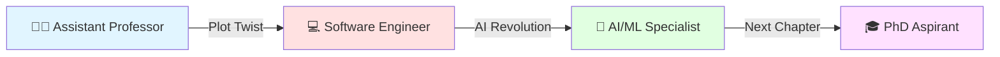

<div align="center">

```ascii
     ██╗ █████╗ ███╗   ██╗██╗  ██╗██╗    ██████╗  █████╗ ██████╗ ███╗   ███╗ █████╗ ██████╗ 
     ██║██╔══██╗████╗  ██║██║ ██╔╝██║    ██╔══██╗██╔══██╗██╔══██╗████╗ ████║██╔══██╗██╔══██╗
     ██║███████║██╔██╗ ██║█████╔╝ ██║    ██████╔╝███████║██████╔╝██╔████╔██║███████║██████╔╝
██   ██║██╔══██║██║╚██╗██║██╔═██╗ ██║    ██╔═══╝ ██╔══██║██╔══██╗██║╚██╔╝██║██╔══██║██╔══██╗
╚█████╔╝██║  ██║██║ ╚████║██║  ██╗██║    ██║     ██║  ██║██║  ██║██║ ╚═╝ ██║██║  ██║██║  ██║
 ╚════╝ ╚═╝  ╚═╝╚═╝  ╚═══╝╚═╝  ╚═╝╚═╝    ╚═╝     ╚═╝  ╚═╝╚═╝  ╚═╝╚═╝     ╚═╝╚═╝  ╚═╝╚═╝  ╚═╝
```

### 🎯 Full Stack Architect | AI Whisperer | Code Artist | Former Professor

<a href="mailto:jankiparmar357@outlook.com"></a>
<a href="https://linkedin.com/in/yourprofile"></a>
<a href="https://github.com/76jankihere"></a>

```typescript
const janki = {
    location: "🗺️ Dayton, Ohio → Ready to relocate anywhere in USA",
    currentMission: "🚀 Turning AI dreams into production reality",
    superpower: "🎨 Building systems that don't just work—they WOW",
    secretWeapon: "🧠 Academia meets Silicon Valley hustle",
    availability: "✅ Open for opportunities that challenge the status quo"
};
```

</div>

---

## 🎭 The Plot Twist: From Professor to Production

Most people pick **either** teaching **or** building. I chose **both**.

**The Journey:**


**Translation:** I've taught Computer Science to 1000+ students **AND** shipped code that eliminated **1 MILLION errors per month**. Not many people can say that.

---

## 💥 The Numbers That Matter

<table>
<tr>
<td width="50%">

### 📊 Impact Metrics

```python
achievements = {
    "errors_eliminated": "1M/month → 0",
    "api_speedup": "30% faster",
    "customer_happiness": "↑90%",
    "sales_boost": "↑20%",
    "code_quality": "Enterprise-grade",
    "teaching_reach": "100+ students"
}

print("🏆 Not just coding. Creating impact.")
```

</td>
<td width="50%">

### 🎯 Quick Stats

- 🧠 **2 Master's Degrees** (4.0 & 3.2 GPAs)
- 📝 **Published AI Researcher**
- ☁️ **AWS Certified Professional**
- 👥 **4+ years** building production systems
- 🎓 **2+ years** teaching CS
- 🚀 **Currently:** Building AI @ NovaHire

</td>
</tr>
</table>

---

## 🛠️ Arsenal of Technologies

<details>
<summary>👉 <b>Click to see what I actually use (not just what I know)</b></summary>

<br>

### 🤖 AI/ML Stack (My Playground)


**Real Talk:** I don't just call APIs. I architect intelligent systems that learn, adapt, and surprise you.

### 💻 Languages (My Native Tongues)


### 🎨 Frontend (Making It Pretty)


### ⚙️ Backend (The Real Magic)


### ☁️ Cloud & DevOps (Scaling Things Up)


### 🗄️ Databases (Data Whisperer)


</details>

---

## 🎯 Projects That Actually Matter

> These aren't tutorial projects. These are **production-grade systems** that solve **real problems**.

### 🤖 AI Chat Assistant
**The Problem:** Generic chatbots are boring and don't remember context.  
**My Solution:** Real-time AI assistant with memory, personality, and security.  
**Tech DNA:** React + TypeScript + OpenAI + Stream Chat + JWT Auth  
**The Wow Factor:** Context-aware conversations that feel human.

### 🛒 EzShopping AI
**The Problem:** Finding products online is like finding a needle in a haystack.  
**My Solution:** LLM-powered shopping assistant that actually understands what you want.  
**Tech DNA:** Python + LangChain + NLP + FastAPI + Streamlit  
**The Wow Factor:** Matches products to queries better than humans.

### 📱 Xperi AR EdTech
**The Problem:** Learning from textbooks is outdated.  
**My Solution:** AR interface that turns the world into your classroom.  
**Tech DNA:** TensorFlow Lite + Kotlin + Android + 3D Recognition  
**The Wow Factor:** 30% faster inference on mobile devices.

---

## 🔥 What Makes Me Different

<table>
<tr>
<td width="33%" align="center">

### 🎓 Academic Brain
Former **Assistant Professor**  
Taught advanced CS courses  
Published AI researcher  
PhD aspirant

</td>
<td width="33%" align="center">

### 💻 Industry Hands
**4+ years** shipping code  
Built systems at **scale**  
**1M errors → 0**  
**90%** issue reduction

</td>
<td width="33%" align="center">

### 🚀 AI Pioneer
Building **LLM applications**  
**Agentic workflows**  
**RAG pipelines**  
Production AI systems

</td>
</tr>
</table>

---

## 📚 Education & Badges

<table>
<tr>
<td>

**🎓 MS in Computer Engineering**  
Wright State University, Ohio  
GPA: 3.2/4.0 | 2023-2025

**🎓 MCA (Master of Computer Applications)**  
Charotar University, India  
GPA: 4.0/4.0 | 2019-2021

</td>
<td>

**☁️ AWS Certified Cloud Practitioner**  
Valid: 2025-2028

**🔐 Deloitte Cyber Security Simulation**  
Completed: 2025

**📄 Published Research**  
Facial Expression Recognition, 2023

</td>
</tr>
</table>

---

## 💼 Currently Seeking

<div align="center">

### 🎯 I'm Looking For Roles That:

```diff
+ Challenge the status quo
+ Involve cutting-edge AI/ML
+ Value both depth AND breadth
+ Appreciate academic rigor AND startup speed
+ Offer growth, not just a job

- Boring CRUD apps
- Tech debt maintenance
- No room for innovation
```

### 📍 Ideal Positions

🤖 **AI/ML Engineer** • ☁️ **Cloud Architect** • 📊 **Data Engineer**  
🔬 **Research Engineer** • 🚀 **Founding Engineer** • 🎓 **PhD with Funding**

</div>

---

## 🎲 Fun Facts & Easter Eggs

<details>
<summary>🎮 Click for the behind-the-scenes</summary>

<br>

- 🌍 **From India to Ohio:** Crossed continents for the American dream
- 👩‍🏫 **Classroom to Codebase:** From teaching algorithms to building them
- 🤖 **AI Obsessed:** I read AI papers for fun (yes, really)
- ☕ **Coffee Powered:** `while(awake) { code(); }`
- 🎯 **Next Goal:** PhD + Building the next big thing
- 💡 **Philosophy:** Code is poetry, AI is magic, education is power
- 🚀 **Motto:** "If it doesn't make you go 'wow', it's not worth building"

</details>

---

## 📬 Let's Build Something Amazing

<div align="center">

### 💬 I'm Most Responsive On:

📧 **Email:** jankiparmar357@outlook.com ← **Best way to reach me**  
📱 **Phone:** +1 (937) 260-6122  
💼 **LinkedIn:** [Let's connect](https://linkedin.com/in/yourprofile)  
🌐 **Portfolio:** [Check my work](https://yourportfolio.com)

---

### 🎯 Quick Response Promise

```javascript
const responseTime = {
    goodOpportunities: "< 24 hours",
    amazingOpportunities: "< 6 hours",
    worldChangingIdeas: "I'm already typing..."
};
```

---


### 💡 *"Code that doesn't just work—it tells a story"*

**⚡ Available Now | Open to Relocation | No Visa Sponsorship Needed ⚡**

</div>
